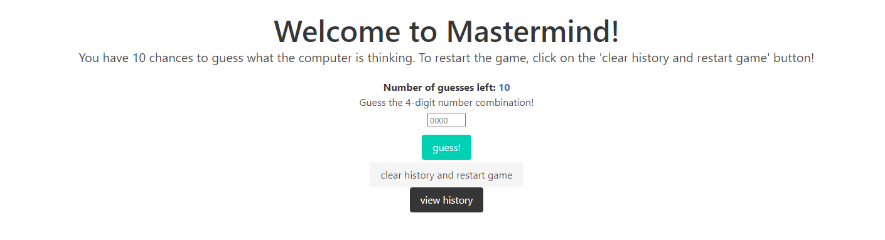
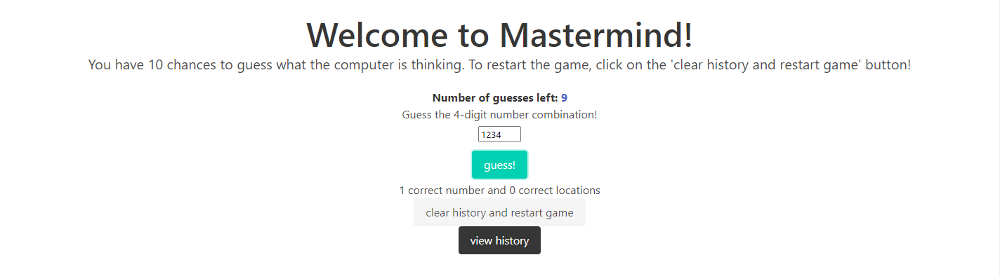
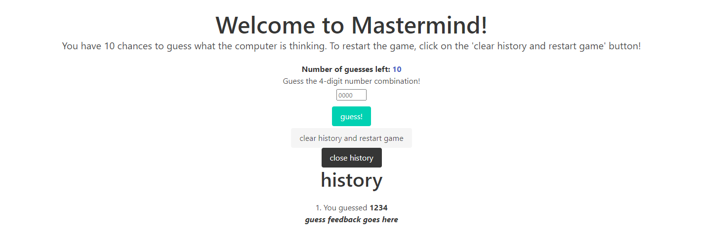

# Mastermind Game

## Description

**_[Click HERE to visit the deployed application!](https://stark-earth-78620.herokuapp.com/)_**

**Mastermind** is a MERN stack web application where users have 10 chances to guess the four-digit number combination that the computer is thinking.

Technologies used:

- MERN stack (MongoDB, Express.js, React JS, Node)
- Heroku for deployment
- GraphQL
- Apollo Server
- Mongoose
- _[random.org API](https://www.random.org/clients/http/api/)_
- Bulma for CSS

## Table of Contents

- [Future](#future)
- [Usage](#usage)
- [Screenshots](#screenshots)
- [Credit](#Credit)


## Future

### Future Development

* fix history to update in realtime
  * currently, the history is updated in the database in the backend, but does not update until the page is refreshed
* fix adding guesses to database after the first guess
  * currently, the first guess is properly added to the database, but there is a bug that stops following guesses from being added properly to the database until the page is refreshed again
  * however, the front-end is still able to give and display responsive feedback after each guess
* fix adding feedback to database properly
* fix history bug when a guess or feedback is null
  * currently, there is a bug where the page is blank if we try to access the user history through the front-end when either a `guess` or `feedback` is `NULL`
* fix bug where users are allowed to keep guessing even after winning/losing
* deployed application's history is not connecting to MongoDB database, please see installation instructions below to run this on your own device! :) 


## Usage

***If the page breaks when 'view history' is clicked, please refresh the page and click 'clear history and restart game' (see bug description above)***

### If you prefer to run this on your local device, please:

* Make sure you have MongoDB and Node installed on your local device!

* Then, in the root directory of the project, run:

```
npm i
```

```
npm run develop
```

* To seed the history:

```
npm run seed
```

* To CLEAR everything from local database:

```
npm run resetSeed
```

* To run server queries while server is running, please visit [http://localhost:3001/graphql](http://localhost:3001/graphql)

  * getHistory query

```
query getHistory {
  histories {
    _id
    historyId
    guess {
      _id
      historyId
      guessBody
    }
    feedback {
      _id
      historyId
      feedbackBody
    }
  }
}
```

  * getGuesses query

```
query getGuesses {
  guesses {
    _id
    historyId
    guessBody
  }
}
```

  * getFeedback query

```
query getFeedback {
  feedbacks {
    _id
    historyId
    feedbackBody
  }
}
```

  * addHistory mutation (similar for addGuess and addFeedback, too)

```
mutation addHistory($historyId: Int!) {
  addHistory(historyId: $historyId) {
    _id
    historyId
  }
}
```

  * deleteHistory mutation

```
mutation deleteHistory {
    deleteHistory {
      _id
    }
  }
```


## Screenshots







## Credit

Made with ❤ by [Nikki Esguerra](https://github.com/desguerra)